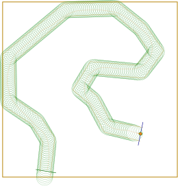
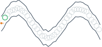

# TinyWorlds

**Tiny simulated worlds for .NET that render themselves.**

Classic-control, toy-classification and navigation environments for evolutionary and RL training —
with exactly one dependency ([FluentSvg](https://github.com/mfagerlund/FluentSvg)) and no game
engine, no GPU library, no physics engine anywhere near them.

```bash
dotnet add package TinyWorlds
```

```csharp
var env = new CartPoleEnvironment();
env.Reset(seed: 1);

var obs = new float[env.InputCount];
var act = new float[env.OutputCount];

while (!env.IsTerminal())
{
    env.GetObservations(obs);
    act[0] = MyPolicy(obs);
    float reward = env.Step(act);
}

// ...and then actually look at what happened:
var svg = new Svg("cartpole.svg", new Vector2(480, 200));
env.Render(svg);
svg.SaveToFile();
```

## Why

Every world here renders itself to SVG, and `Render` is a **required** interface member, not an
optional extra. A world you cannot look at is a world you debug by printing floats at it.

Worlds that move go further and replay a whole episode as one animated SVG:

```csharp
var env = new CartPoleEnvironment();
env.Recording = true;          // opt-in — see below
env.Reset(seed: 1);
while (!env.IsTerminal()) { /* ...step it... */ }

var svg = new Svg("cartpole.svg", new Vector2(480, 220));
env.RenderAnimated(svg);       // the whole episode, looping
svg.SaveToFile();
```

Because the only dependency is FluentSvg, that works headless — inside a unit test, over SSH, on a
CI box, on a laptop with no GPU. Which is precisely when you most need to see what the agent
actually did.

`Recording` is **off by default**, deliberately. These worlds run inside evolutionary inner loops —
hundreds of individuals times hundreds of generations — and recording by default would be an
invisible memory leak paid by every training run to serve the rare debugging one.

Animation is SMIL attribute animation: shapes are emitted once and their attributes carry one value
per frame, so the file scales with *shapes + frames* rather than *shapes × frames*, and the SVG
interpolates between frames for free. A 400-step cart-pole replay is ~33 KB.

## Gallery

Generated by `dotnet run --project samples/Gallery`. Every image is a real world, stepped by a real
policy, asked to draw itself — nothing here is a mock-up. **Open the top row in a browser; they
move.** (GitHub renders SVG in READMEs statically, so you get the first frame here.)

| | |
|---|---|
|  400 steps, animated |  300 steps, animated |
|  300 steps, animated |  a complete lap, animated |
|  |  |
|  |  parked — this world is broken, see below |

XOR and Spiral are stills because they are static datasets — the picture *is* the dataset, and
animating a ring hopping between fixed points would be motion for its own sake. Landscape is a
still for a different reason: its heatmap is 1,600 rects re-sliced through the agent's position
every frame, so animating it honestly means animating all of them.

The racetrack lap is a real evolved policy: a **linear** map from 9 sensors to (steering, throttle),
found by CEM in 11 generations, collecting 256/256 progress markers in 222 steps. The weights are in
`samples/Gallery/Program.cs` — nothing hand-tuned.

The corridor is parked at the start line because `SimpleCorridorEnvironment` is **unsolvable**, and
that is a measured claim, not a shrug: an omniscient oracle handed the checkpoint list collects 1 of
40. Details and root cause are in the class docs.

## The worlds

| World | Obs | Act | What it is |
|---|---|---|---|
| `CartPoleEnvironment` | 4 | 1 | Classic cart-pole. The "does my optimizer work at all" test. |
| `DoublePoleEnvironment` | 6 (or 3) | 1 | Two poles of different lengths on one cart. Genuinely hard; the short pole is what makes it. Optionally hides velocities, which makes it non-Markovian and demands recurrence. |
| `XOREnvironment` | 2 | 1 | XOR. Not linearly separable, four cases, no excuses. |
| `SpiralEnvironment` | 2 | 1 | Two interleaved spirals. Looks trivial until you see the picture. |
| `LandscapeEnvironment` | varies | n | Gradient descent as a control problem over Rosenbrock/Rastrigin/Ackley/Schwefel/Sphere. |
| `TargetChaseEnvironment` | 4 | 2 | Point-mass rocket chasing targets in a box. |
| `FollowTheCorridorEnvironment` | 9 | 2 | A drifting car on a hand-drawn race track, 9 range sensors. The track is authored, not generated, so its corners have no pattern to memorise. Solved by a linear policy in 11 CEM generations — a good optimizer smoke test rather than a hard benchmark. |
| `SimpleCorridorEnvironment` | 9 | 2 | Procedural sine corridor. **Broken — unsolvable.** Kept, documented, and not silently "fixed", because any fix changes the benchmark. |

## The one rule

**A world may depend on `System.*` and FluentSvg. Nothing else. Ever.**

That is the entire value proposition, and it is easy to erode one innocent-looking reference at a
time. If a world needs a real physics engine, do not add the engine here — keep it behind a factory
interface on the consumer's side and let this core stay lean.
[Evolvatron.Clones](https://github.com/mfagerlund) does exactly that: its simulation core is
FluentSvg-only, with Rigidon isolated in a separate adapter project behind `IMotorBody`. That
pattern is why this repo exists.

Corollary: the CPU worlds here are *reference* implementations. GPU-resident versions of the same
task live with their trainer, not here — they need ILGPU, and ILGPU is exactly what must never
appear in this csproj.

## Conventions

- **Deterministic.** `Reset(seed)` must replay identically. A benchmark that drifts is not a
  benchmark. Worlds own their `Random`; none of them touch global state.
- **+y is up.** Worlds think in maths convention. SVG's +y points *down*, so rendering flips at the
  drawing boundary via `SvgCoords.P` — never in the world's own arithmetic. Skip this and your
  cartpole renders as a pendulum.
- **Render at true scale.** Draw using the world's own constants (`CAR_RADIUS`, `TargetRadius`, …),
  not hand-picked numbers. A capture radius drawn at a decorative size is a lie, and sizes tuned for
  a 5-unit world vanish in a 200-unit one.
- **`Render` must not mutate state.** It is a view, callable after any `Step`.

## Layout

```
src/TinyWorlds/     the library — Classic/, Toy/, Nav/
samples/Gallery/    regenerates gallery/*.svg
gallery/            committed SVGs, so the README renders on GitHub
```

## License

MIT.
